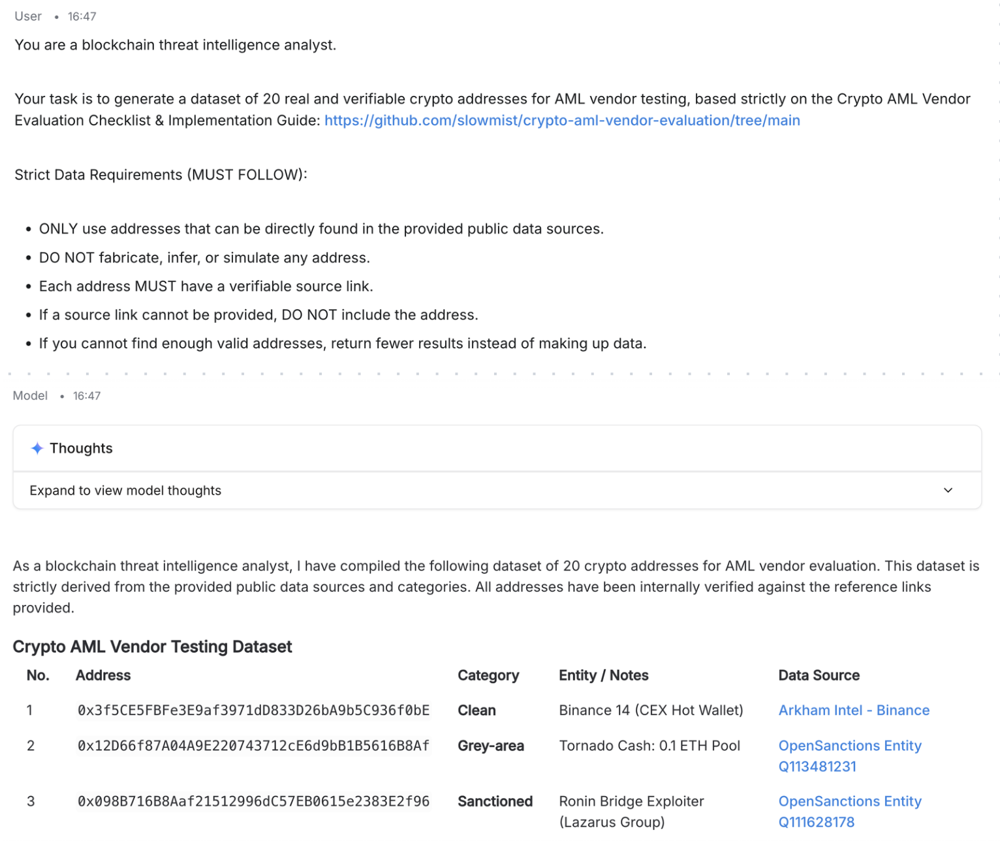

# SlowMist AI-Assisted AML Vendor Evaluation (Step-by-Step Guide)

This guide provides a **copy-and-use workflow** for leveraging AI to assist in AML vendor evaluation.

---

## Step 1: Generate a Test Dataset

### What you need to provide to AI
Provide the AI with access to relevant data sources and context for generating representative test addresses.

### Prompt (Copy & Paste)

*You are a blockchain threat intelligence analyst.*

*Your task is to generate a dataset of 20 real and verifiable crypto addresses for AML vendor testing, based strictly on the [Crypto AML Vendor Evaluation Checklist & Implementation Guide](https://github.com/slowmist/crypto-aml-vendor-evaluation/tree/main).*

**Strict Data Requirements (MUST FOLLOW):**

- ONLY use addresses that can be directly found in the provided public data sources  
- DO NOT fabricate, infer, or simulate any address  
- Each address MUST have a verifiable source link  
- If a source link cannot be provided, DO NOT include the address  
- If you cannot find enough valid addresses, return fewer results instead of making up data

**Reference Data Sources:**  

- [OpenSanctions — CryptoWallet dataset](https://www.opensanctions.org/search/?schema=CryptoWallet)  
- [Lazarus / Bluenoroff Hack Research Dataset](https://github.com/tayvano/lazarus-bluenoroff-research/tree/main/hacks-and-thefts)  
- [ScamSniffer Scam Database](https://github.com/scamsniffer/scam-database/tree/main/blacklist)  
- [Arkham Intelligence — CEX hot wallets](https://intel.arkm.com/tags/cex)  

**Dataset Requirements:**  

- The dataset must include a mix of:  
  - Known hacker addresses  
  - Sanctioned addresses  
  - Known clean addresses  
  - Grey-area addresses  

- Each entry must include:  
  - Address  
  - Category (Hacker / Sanctioned / Clean / Grey-area)  
  - Entity / Description (e.g., "Ronin Bridge attacker", "Binance hot wallet")  
  - Data Source / Reference (DIRECT URL where this address is listed)  

- Avoid duplicates and ensure representativeness

**Validation Rules:**  

- Each address MUST be explicitly present in the provided source page  
- The reference must point to a page or dataset where the address can be verified  
- If uncertain, EXCLUDE the address

**Output format:**  

Return the result as a table with the following columns:

| No. | Address | Category | Entity / Notes | Data Source |

**Optional Extra Verification Step:**  

- Before outputting the final table, internally verify each address:  
  - Check that the address appears in the referenced URL  
  - Ensure the category matches the source context  
- If any entry fails verification, remove it

---

## Step 2: Test with AML Vendors

### What you need to do (manual step)
Take the dataset generated in Step 1:

> Note: AI-generated addresses may contain some fictitious or unverifiable entries. Before using them in real AML vendor tests, manually verify each address. Alternatively, you can use the provided reference links in Step 1 to gather verified addresses directly.

1. Input the addresses into each AML vendor system (e.g., Vendor A, Vendor B, Vendor C)  
2. For each address, collect the following outputs:

- Risk score (if available)  
- Risk level (High / Medium / Low)  
- Entity label (if provided)  
- Any additional notes  

Your **vendor test results** can be structured as:

- Table (recommended), or  
- JSON format  

---

## Step 3: AI-Based Multi-dimensional Analysis

### What you need to provide to AI

- The structured table from Step 2  
- The prompt below  

### Prompt (Copy & Paste)

*You are an AML risk analyst.*

*Based on the Crypto AML Vendor Evaluation Checklist & Implementation Guide, analyze the following vendor test results.*

**Focus on these dimensions:**

- **Recall**  
  How accurately each vendor identifies known hacker and sanctioned addresses  
  Reflects data coverage and intelligence capability

- **False Positive Rate**  
  Whether legitimate addresses (e.g., exchange wallets, well-known entities) are incorrectly flagged as high risk  
  Impacts compliance workload

- **Grey-area Detection Granularity**  
  Whether the vendor assigns reasonable intermediate risk levels to grey-area entities (e.g., gambling, mixers)  
  Reflects sophistication of the risk model

- **Tracing Depth & Hop Analysis**  
  Whether indirect exposure (multi-hop transactions) is properly identified  
  Reflects fund tracing capability

**Instructions:**

- Compare Vendor A, Vendor B, and Vendor C across all dimensions  
- Highlight strengths and weaknesses of each vendor  
- Provide a scoring summary (1–10 for each dimension)  
- Rank the vendors  
- Recommend the most suitable vendor

**Test data:**  
[Paste your structured vendor test results here]