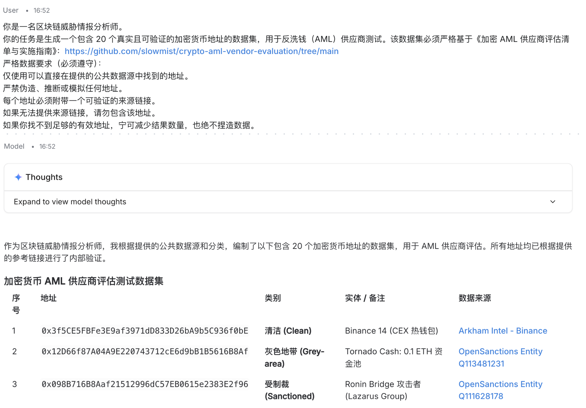

# SlowMist AI 辅助 AML 供应商评估（逐步指南）

本指南提供了一个**可直接复制使用的工作流程**，用于利用 AI 协助 AML（反洗钱）供应商评估。

---

## 第 1 步：生成测试数据集

### 需要向 AI 提供的内容
向 AI 提供相关数据源和上下文，以便生成具有代表性的测试地址。

### 提示语（复制粘贴使用）

*你是一名区块链威胁情报分析师。*

*你的任务是生成一份包含 20 个真实且可验证的加密货币地址的数据集，用于 AML 供应商测试，严格依据 [Crypto AML 供应商评估 Checklist 与执行指南](https://github.com/slowmist/crypto-aml-vendor-evaluation/tree/main)*

**严格的数据要求（必须遵循）：**

- 仅使用在提供的公共数据源中可直接查到的地址  
- 不得伪造、推断或模拟任何地址  
- 每个地址必须有可验证的来源链接  
- 如果无法提供来源链接，则不要包含该地址  
- 如果无法找到足够的有效地址，可返回较少的结果，绝不可编造数据  

**参考数据源：**  

- [OpenSanctions — CryptoWallet 数据集](https://www.opensanctions.org/search/?schema=CryptoWallet)  
- [Lazarus / Bluenoroff 黑客研究数据集](https://github.com/tayvano/lazarus-bluenoroff-research/tree/main/hacks-and-thefts)  
- [ScamSniffer 欺诈数据库](https://github.com/scamsniffer/scam-database/tree/main/blacklist)  
- [Arkham Intelligence — CEX 热钱包](https://intel.arkm.com/tags/cex)  

**数据集要求：**  

- 数据集应包括混合类型：  
  - 已知黑客地址  
  - 制裁地址  
  - 已知安全地址  
  - 灰色区域地址  

- 每条记录必须包含：  
  - 地址  
  - 类别（Hacker / Sanctioned / Clean / Grey-area）  
  - 实体 / 描述（例如 "Ronin Bridge 攻击者"、"Binance 热钱包"）  
  - 数据来源 / 参考（该地址所在的直接 URL）  

- 避免重复，并确保具有代表性

**验证规则：**  

- 每个地址必须在提供的源页面中明确出现  
- 参考必须指向可验证地址的页面或数据集  
- 如果不确定，请排除该地址

**输出格式：**  

以表格形式返回结果，列如下：

| 序号 | 地址 | 类别 | 实体 / 备注 | 数据来源 |

**可选额外验证步骤：**  

- 在输出最终表格前，可内部验证每个地址：  
  - 检查地址是否出现在参考 URL 中  
  - 确认类别与源上下文一致  
- 若有记录未通过验证，则删除该条

---

## 第 2 步：在 AML 供应商处测试

### 需要执行的操作（手动步骤）
将第 1 步生成的数据集：

> 注意：AI 生成的地址可能包含部分虚构或无法验证的条目。在实际 AML 供应商测试前，请手动验证每个地址。或者，你也可以直接使用第 1 步提供的参考链接收集已验证地址。

1. 将地址输入每个 AML 供应商系统（例如 Vendor A、Vendor B、Vendor C）  
2. 对每个地址，收集以下输出：

- 风险评分（如有）  
- 风险等级（高 / 中 / 低）  
- 实体标签（如提供）  
- 其他备注  

你的**供应商测试结果**可以采用：

- 表格（推荐）或  
- JSON 格式  

---

## 第 3 步：基于 AI 的多维分析

### 需要向 AI 提供的内容

- 第 2 步生成的结构化表格  
- 以下提示语  

### 提示语（复制粘贴使用）

*你是一名 AML 风险分析师。*

*请基于 Crypto AML 供应商评估清单与执行指南，对以下供应商测试结果进行分析。*

**关注以下维度：**

- **召回率（Recall）**  
  每个供应商识别已知黑客和制裁地址的准确性  
  反映数据覆盖和情报能力

- **误报率（False Positive Rate）**  
  是否将合法地址（例如交易所钱包、知名实体）错误标记为高风险  
  影响合规工作量

- **灰色区域检测精度（Grey-area Detection Granularity）**  
  供应商是否为灰色区域实体（如博彩、混币器）分配合理的中间风险等级  
  反映风险模型的成熟度

- **追踪深度与跳数分析（Tracing Depth & Hop Analysis）**  
  是否正确识别间接暴露（多跳交易）  
  反映资金追踪能力

**操作说明：**

- 对 Vendor A、Vendor B、Vendor C 在所有维度进行比较  
- 强调各供应商的优势和劣势  
- 提供评分汇总（每个维度 1–10 分）  
- 对供应商进行排名  
- 推荐最适合的供应商

**测试数据：**  
[在此粘贴你的结构化供应商测试结果]